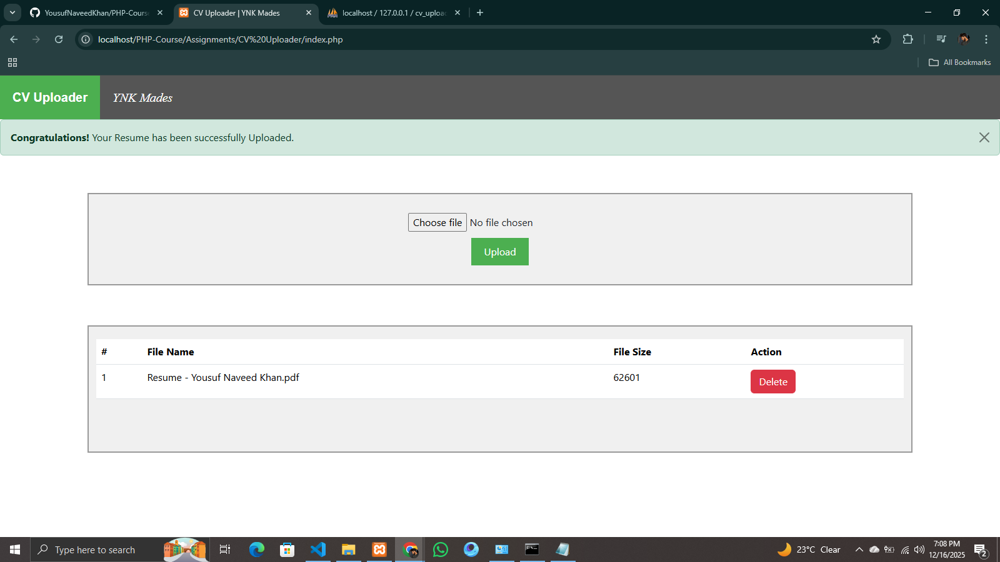
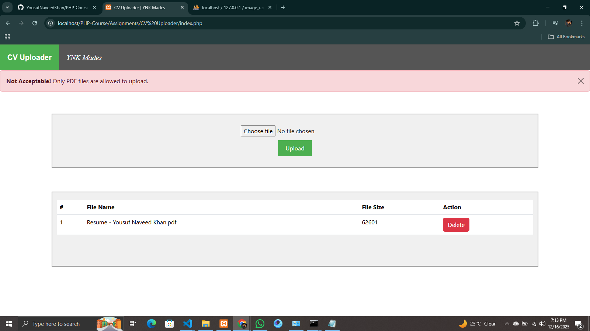
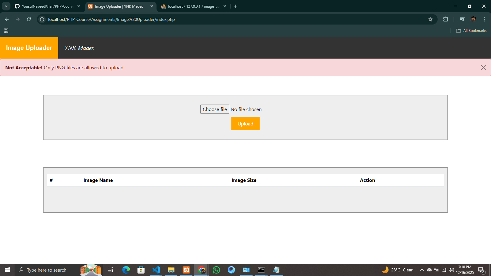
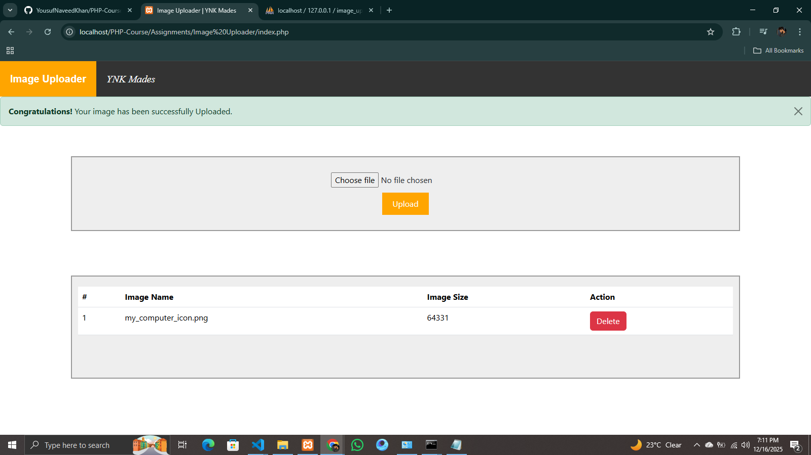

# PHP Assignment: CV Uploader & Image Uploader

**Submission Deadline:** Saturday, **20th December 2025**
**Submission Method:** **GitHub only** (No Google Drive, ZIP files, or WhatsApp submissions will be accepted)

---

## Objective

The purpose of this assignment is to help students understand **PHP file uploading**, **file validation**, **database storage**, **fetching records**, and **delete operations with confirmation**.

You are required to create **two separate PHP-based mini projects**:

1. **CV Uploader (PDF Only)**
2. **Image Uploader (Images Only)**

Both projects must be properly structured and connected with a database.

---

## Task 1: CV Uploader (PDF Only)

### Example Output (Screenshots)

Below are example screenshots to help you understand the expected output clearly:

> These screenshots demonstrate the upload form, validation message, and the data table after uploading a PDF.

---

### Requirements

Create a CV Uploader web page with the following features:

### 1. Upload Section

* A **file input field** (Choose File)
* An **Upload button**
* A text message displayed near the input field, for example:

  > *Only PDF files are allowed.*

### 2. File Validation

* Only **PDF (.pdf)** files are allowed
* If the user tries to upload any other file format, show an **error message** and prevent uploading

### 3. Database Storage

When a valid PDF file is uploaded:

* Save the file in a server directory (e.g. `uploads/cv/`)
* Store the following details in the database:

  * File Name
  * File Size
  * File Path

### 4. Data Display (Table)

Below the upload section, display a table with the following columns:

| # | File Name | File Size | Action |
| - | --------- | --------- | ------ |

* `#` → Serial Number (Auto increment while displaying)
* `File Name` → Name of the uploaded PDF
* `File Size` → File size (KB or MB)
* `Action` → A **Delete** button

### 5. Delete Functionality

* When the user clicks **Delete**:

  * A **confirmation dialog box** must appear (JavaScript confirm)
  * If the user clicks **OK**, the file should:

    * Be deleted from the server
    * Be removed from the database

---|----------|-----------|--------|

* `#` → Serial Number (Auto increment while displaying)
* `File Name` → Name of the uploaded PDF
* `File Size` → File size (KB or MB)
* `Action` → A **Delete** button

### 5. Delete Functionality

* When the user clicks **Delete**:

  * A **confirmation dialog box** must appear (JavaScript confirm)
  * If the user clicks **OK**, the file should:

    * Be deleted from the server
    * Be removed from the database

---

## Task 2: Image Uploader (Images Only)

### Example Output (Screenshots)

Below are example screenshots to help you understand the expected output clearly:

> These screenshots demonstrate image validation & table listing.

---

### Requirements

Create an Image Uploader web page with the following features:

### 1. Upload Section

* A **file input field** (Choose Image)
* An **Upload button**
* A message displayed near the input field, for example:

  > *Only JPG, JPEG, PNG, and GIF images are allowed.*

### 2. File Validation

* Allowed image formats:

  * `.jpg`
  * `.jpeg`
  * `.png`
  * `.gif`
* If the uploaded file is not one of the above formats:

  * Show an **error message**
  * Uploading must fail

### 3. Database Storage

When a valid image is uploaded:

* Save the image in a server directory (e.g. `uploads/images/`)
* Store the following details in the database:

  * Image Name
  * Image Size
  * Image Path

### 4. Data Display (Table)

Below the upload section, display a table with the following columns:

| # | File Name | Image | File Size | Action |
| - | --------- | ----- | --------- | ------ |

* `#` → Serial Number
* `File Name` → Image file name
* `Image` → Display the image

  * Small size
  * **50% rounded (border-radius: 50%)**
* `File Size` → Image size (KB or MB)
* `Action` → **Delete** button

### 5. Delete Functionality

* When **Delete** is clicked:

  * Show a **confirmation dialog box**
  * On **OK**, the image must be deleted from:

    * Server folder
    * Database

---|----------|-------|-----------|--------|

* `#` → Serial Number
* `File Name` → Image file name
* `Image` → Display the image

  * Small size
  * **50% rounded (border-radius: 50%)**
* `File Size` → Image size (KB or MB)
* `Action` → **Delete** button

### 5. Delete Functionality

* When **Delete** is clicked:

  * Show a **confirmation dialog box**
  * On **OK**, the image must be deleted from:

    * Server folder
    * Database

---

## General Instructions

* Proper validation is mandatory (both client-side and server-side recommended)
* Clean UI structure is preferred
* Code should be well-organized and readable

---

## Submission Guidelines

* Upload **both projects** to **GitHub**
* Repository must include:

  * Complete source code
  * Database SQL file
  * Proper folder structure
* **Only GitHub links will be accepted**
* Late submissions will not be entertained
